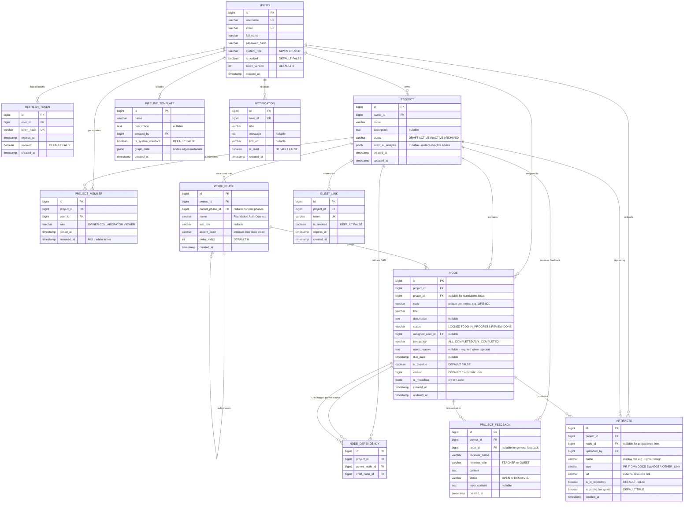

```mermaid
erDiagram
    USERS ||--o{ REFRESH_TOKEN : "has sessions"
    USERS ||--o{ PROJECT : "owns"
    USERS ||--o{ PROJECT_MEMBER : "participates"
    USERS ||--o{ PIPELINE_TEMPLATE : "creates"
    USERS ||--o{ NOTIFICATION : "receives"
    USERS ||--o{ NODE : "assigned to"
    USERS ||--o{ ARTIFACTS : "uploads"

    PROJECT ||--o{ PROJECT_MEMBER : "has members"
    PROJECT ||--o{ WORK_PHASE : "structured into"
    PROJECT ||--o{ NODE : "contains"
    PROJECT ||--o{ NODE_DEPENDENCY : "defines DAG"
    PROJECT ||--o{ ARTIFACTS : "repository"
    PROJECT ||--o{ GUEST_LINK : "shares via"
    PROJECT ||--o{ PROJECT_FEEDBACK : "receives feedback"

    WORK_PHASE ||--o{ WORK_PHASE : "sub-phases"
    WORK_PHASE ||--o{ NODE : "groups"

    NODE ||--o{ NODE_DEPENDENCY : "parent source"
    NODE ||--o{ NODE_DEPENDENCY : "child target"
    NODE ||--o{ ARTIFACTS : "produces"
    NODE ||--o{ PROJECT_FEEDBACK : "referenced in"

    USERS {
        bigint id PK
        varchar username UK
        varchar email UK
        varchar full_name
        varchar password_hash
        varchar system_role "ADMIN or USER"
        boolean is_locked "DEFAULT FALSE"
        int token_version "DEFAULT 0"
        timestamp created_at
    }

    REFRESH_TOKEN {
        bigint id PK
        bigint user_id FK
        varchar token_hash UK
        timestamp expires_at
        boolean revoked "DEFAULT FALSE"
        timestamp created_at
    }

    PROJECT {
        bigint id PK
        bigint owner_id FK
        varchar name
        text description "nullable"
        varchar status "DRAFT ACTIVE INACTIVE ARCHIVED"
        jsonb latest_ai_analysis "nullable - metrics insights advice"
        timestamp created_at
        timestamp updated_at
    }

    PIPELINE_TEMPLATE {
        bigint id PK
        varchar name
        text description "nullable"
        bigint created_by FK
        boolean is_system_standard "DEFAULT FALSE"
        jsonb graph_data "nodes edges metadata"
        timestamp created_at
    }

    PROJECT_MEMBER {
        bigint id PK
        bigint project_id FK
        bigint user_id FK
        varchar role "OWNER COLLABORATOR VIEWER"
        timestamp joined_at
        timestamp removed_at "NULL when active"
    }

    WORK_PHASE {
        bigint id PK
        bigint project_id FK
        bigint parent_phase_id FK "nullable for root phases"
        varchar name "Foundation Auth Core etc"
        varchar sub_title "nullable"
        varchar accent_color "emerald blue slate violet"
        int order_index "DEFAULT 0"
        timestamp created_at
    }

    NODE {
        bigint id PK
        bigint project_id FK
        bigint phase_id FK "nullable for standalone tasks"
        varchar code "unique per project e.g. WPE-001"
        varchar title
        text description "nullable"
        varchar status "LOCKED TODO IN_PROGRESS REVIEW DONE"
        bigint assigned_user_id FK "nullable"
        varchar join_policy "ALL_COMPLETED ANY_COMPLETED"
        text reject_reason "nullable - required when rejected"
        timestamp due_date "nullable"
        boolean is_overdue "DEFAULT FALSE"
        bigint version "DEFAULT 0 optimistic lock"
        jsonb ui_metadata "x y w h color"
        timestamp created_at
        timestamp updated_at
    }

    NODE_DEPENDENCY {
        bigint id PK
        bigint project_id FK
        bigint parent_node_id FK
        bigint child_node_id FK
    }

    ARTIFACTS {
        bigint id PK
        bigint project_id FK
        bigint node_id FK "nullable for project repo links"
        bigint uploaded_by FK
        varchar name "display title e.g. Figma Design"
        varchar type "PR FIGMA DOCS SWAGGER OTHER_LINK"
        varchar url "external resource link"
        boolean is_in_repository "DEFAULT FALSE"
        boolean is_public_for_guest "DEFAULT TRUE"
        timestamp created_at
    }

    PROJECT_FEEDBACK {
        bigint id PK
        bigint project_id FK
        bigint node_id FK "nullable for general feedback"
        varchar reviewer_name
        varchar reviewer_role "TEACHER or GUEST"
        text content
        varchar status "OPEN or RESOLVED"
        text reply_content "nullable"
        timestamp created_at
    }

    GUEST_LINK {
        bigint id PK
        bigint project_id FK
        varchar token UK
        boolean is_revoked "DEFAULT FALSE"
        timestamp expires_at
        timestamp created_at
    }

    NOTIFICATION {
        bigint id PK
        bigint user_id FK
        varchar title
        text message "nullable"
        varchar link_url "nullable"
        boolean is_read "DEFAULT FALSE"
        timestamp created_at
    }
```
